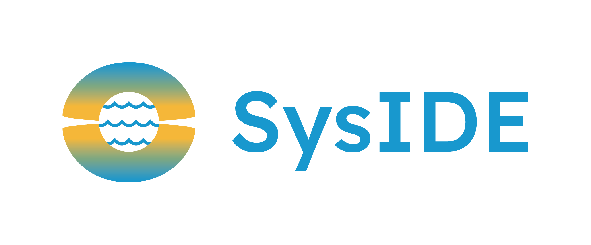

# SysIDE Community Edition

<!-- markdownlint-capture -->
<!-- markdownlint-disable-file no-inline-html heading-increment -->

<table align="center"><tr><td align="center" width="9999">


### SysML v2 'as code' modeling and analysis system

_SysIDE_ (pronounced "seaside") is a transformational SysML v2 systems-as-code modeling tool

</td></tr></table>

<!-- markdownlint-restore -->

[](https://gitlab.com/sensmetry/public/sysml-2ls/-/commits/main)
[](https://sensmetry.gitlab.io/public/sysml-2ls)
[](https://gitlab.com/sensmetry/public/sysml-2ls/-/releases)
[](https://marketplace.visualstudio.com/items?itemName=sensmetry.sysml-2ls)
[](https://open-vsx.org/extension/sensmetry/sysml-2ls)

---

_SysIDE Community Edition (SysIDE CE)_ is a free and open source SysML v2 textual editing and analysis system, bringing rich SysML v2 language support to Visual Studio Code. _SysIDE CE_ can also be integrated into other applications and automated workflows which need to interact with SysML v2 textual representations.

The main enabling components of _SysIDE CE_ are a parser and a language server for SysML v2 and KerML [2024-05 release](https://github.com/Systems-Modeling/SysML-v2-Release/tree/2024-05) specifications.

_SysIDE CE_ provides features such as:

- Semantic highlighting
- Autocompletion
- Code navigation
- Formatting
- Real-time syntax and semantic validation
- Reference search
- Folding
- Document symbols
- Renaming
- Documentation on hover

_SysIDE CE_ is built and maintained by [**Sensmetry**](https://sensmetry.com/), a company focused on ensuring the safety and reliability of mission- & safety-critical automated systems.

_SysIDE CE_ is an open source project with contributions from user and developer community highly encouraged and welcome. For further information about the open source license, see [LICENSE](/LICENSE). To contribute, please see the [CONTRIBUTING.md](/CONTRIBUTING.md) document.

## Editions

There are two editions of _SysIDE_:

- _SysIDE CE_ - free and open source version of _SysIDE_, enabling modern 'as code' modeling for everyone
- _SysIDE Pro_ - a licenced version of _SysIDE_, providing advanced features & performance for power-users

If you want to get in touch regarding any edition of _SysIDE_, reach out to Sensmetry at `syside(at)sensmetry(dot)com`

## Quick start

1. Install the latest extension from the marketplace.
2. Open a SysML v2 (.sysml) file and the extension will activate.
3. Upon the first activation a pop-up will be displayed asking you to either locate an existing SysML v2 standard library (`sysml.library` directory from [SysML-v2-Release](https://github.com/Systems-Modeling/SysML-v2-Release/tree/2024-02/sysml.library) repository) or download it. The pop-up may also be disabled globally or in the workspace and the extension will continue without standard library support.

## Features

The extension provides basic features to support SysML v2 document editing:

<!-- markdownlint-capture -->
<!-- markdownlint-disable-file no-inline-html -->

- Autocompletion  
  
  <br> <br>

- Code navigation  
  
  <br> <br>

- Semantic highlighting  
  
  <br> <br>

- Auto-formatting:

  - Comment bodies  
  
  <br> <br>

  - Elements  
  
  <br> <br>

- Renaming  
  
  <br> <br>

- Hovers  
  
  <br> <br>

- References  
  
  <br> <br>

- Document symbols  
  
  <br> <br>

- Folding  
  

<!-- markdownlint-restore -->

## Known Limitations

See [docs/known_limitations.md](docs/known_limitations.md).

## Developer instructions

### Building from source code

- [Install `pnpm`](https://pnpm.io/installation)
- Run `pnpm install` to install dependencies.
- Run `pnpm run grammar:generate` to generate TypeScript code from the grammar
  definition.
  <!-- Langium generator is broken until `addSuperPropertiesInternal`
  is fixed (not using the set parameter). -->
- Run `pnpm run build` to compile all TypeScript code.

### Make changes

- Run `pnpm run install-hooks` to install git hooks.
- Run `pnpm run watch` to have the TypeScript compiler run automatically after
  every change of the source files.
- Run `pnpm run grammar:watch` to have the Langium generator run automatically
  after every change of the grammar declaration.
- You can relaunch the extension from the debug toolbar after making changes to
  the files listed above.
- You can also reload (`Ctrl+R` or `Cmd+R` on Mac) the VS Code window with your
  extension to load your changes.

### Packaging

To package the extension for VS Code run:
  
  ```bash
  pnpm run vscode:package
  ```

## Contributing

See [CONTRIBUTING.md](/CONTRIBUTING.md).

## Disclaimer

_SysIDE CE_ is developed for the language that carries the name of SysML which is a trademark of OMG. _SysIDE CE_ has been started and continues to be maintained by [Sensmetry](https://sensmetry.com/).

The project is open source. For further information, see [LICENSE](/LICENSE).
